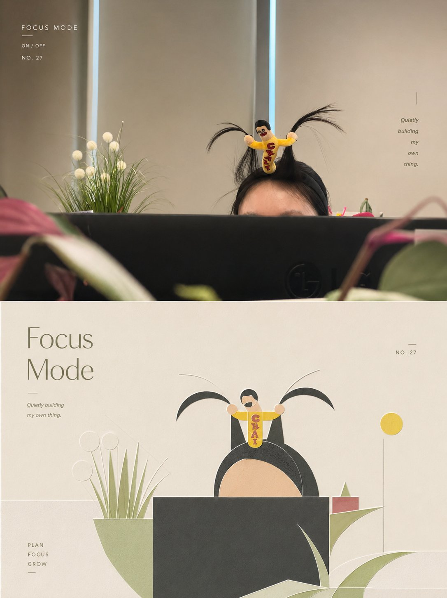
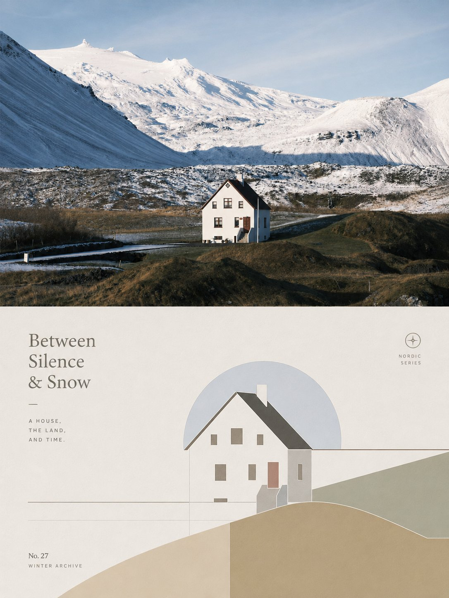

<p align="center">
  
</p>

<div align="center">

# 🦁 XXD Panel 026

### Translate photographic facts into quiet, gentle geometry that remains unmistakably recognisable

[](./SKILL.md)
[](#four-outputs-one-humanist-geometry)
[](#boundaries-and-trust)

<a href="README.md">简体中文</a> · <strong>English</strong> · <a href="README.ja.md">日本語</a> · <a href="README.ko.md">한국어</a> · <a href="README.ar.md">العربية</a>

</div>

> RECOGNISE QUIETLY · REDUCE GENTLY · LET THE PAPER BREATHE

XXD Panel 026 is an image-generation skill for Codex and compatible agents. It reads the subject, contour, posture, structural axes, distance, and narrative relationships in a photograph, then translates that evidence into minimal geometry, fine lines, a soft colour family, and barely raised paper relief.

It does not place a muted-colour filter over a photo. It preserves why that particular photograph deserves attention.

## Why it exists

Many “photo to minimal poster” workflows end with the same circles, pastel blocks, and architectural lines. The result may look calm, yet have almost nothing to do with the source. Gesture disappears, relationships are replaced by a template, and the same title could survive a completely different image.

026 treats quietness as evidence-based design:

- at least three source-specific identity cues must remain;
- geometry, contour, structure, and negative space reorganise the subject rather than erase it;
- four to six low-stimulation colour roles are translated from the source instead of selected from a fixed palette;
- depth is limited to pressed or gently raised paper, never overt 3D;
- before generation, choose original-prompt-generated text, user-exact text, or text-free output; original-prompt-generated text produces a source-bound title and microcopy.

## From photographic fact to humanist geometry

The internal method is:

**Observe → Identify → Reduce → Humanise → Relief → Typeset → Check**

The subject remains the sole visual core. The composition tends towards the centre without becoming rigidly symmetrical; positive and negative shape, measured density, small offsets, and generous quiet space create the rhythm. Forms should feel lightly pressed out of fine paper, not like cards floating inside an interface.

Colours may move towards ivory, warm white, pale grey, sand, dusty pink, pale ochre, mist blue, or sage. These are directions, not presets. The principal, supporting, and structural colours must remain explainable through the current photograph's light, material, or atmosphere.

## Samples · from X

> [Xiaoxiaodong (@xiaoxiaodong01)](https://x.com/xiaoxiaodong01/status/2090433161096581434) · 20 August 2026<br>
> GPT2 × relief × crop × restraint × aesthetic prompt × VOL.026<br>
> It does not redraw the photograph. It finds what matters, reduces the scene to a few lines and colour planes, and still remains immediately recognisable.

<table>
  <tr>
    <td width="50%"><a href="https://x.com/xiaoxiaodong01/status/2090433161096581434"></a></td>
    <td width="50%"><a href="https://x.com/xiaoxiaodong01/status/2090433161096581434"></a></td>
  </tr>
</table>

<p align="center"><a href="https://x.com/xiaoxiaodong01/status/2090433161096581434">View the original post and full prompt →</a></p>

These samples demonstrate the 026 aesthetic motive; they do not turn the post's earlier canvas into a current default. The four modes still follow the explicit pre-generation canvas and custom sizing logic below.

## The original brief is authoritative

`references/026-source.md` is this project's sole creative and aesthetic authority. The Skill no longer summarizes or expands it, and it does not impose a shared palette, colour plan, aesthetic motive, title, or microcopy package. GPT Image 2 follows that brief's own rules for colour, material, composition, whitespace, wording, and typography.

Mode and size completely replace the legacy 3:4 top-bottom delivery container without rewriting the transformation aesthetic. Each asset sends GPT Image 2 one selected mode's final contract instead of asking it to interpret four alternatives inside a generic template.

## Four combinable output modes

Select one or more of `top-bottom`, `left-right`, `design-only`, and `wallpaper-pack`. When several are selected, each is generated independently with its own prompt.

- `top-bottom`: one complete canvas with the reality view above and transformed design below.
- `left-right`: one complete canvas whose left-right structure runs from top edge to bottom edge, source left and design right. Typography stays inside that structure rather than creating a shared third footer; widths may be asymmetric.
- `design-only`: the source is a non-visible reference for identity, structure, colour logic, and facts; every visible element follows this Panel's transformation language.
- `wallpaper-pack`: each device receives an independently composed full-canvas transformed wallpaper, with no source-photo region.

There is no seam, midpoint-percentage, or pixel-coordinate test. Deterministic assembly is used only when the user explicitly requests exact panel geometry or pixel-identical source preservation.

Ordinary sizes are also multi-select: auto-fit, source aspect, 1:1, 3:4, 4:3, 4:5, 5:4, 2:3, 3:2, 9:16, 16:9, 21:9, 5:7, 7:5, or custom ratios/exact pixels. There is no silent default. Every distinct aspect is independently recomposed from the same verbatim source brief.

Wallpaper packs may be linked or independent. A linked pack creates one anchor image, then recomposes each remaining device from the original source plus that anchor; it never crops one image into four sizes.

Each invocation creates one task directory and writes every final PNG directly into it, with no source, mode, size, or device subfolders. Filenames carry those dimensions instead, for example `source-01-left-right-3x2-2160x1440.png` and `source-01-wallpaper-linked-phone-1440x3200.png`.

## Text modes

Before generation, resolve one of three choices:

1. **Model generates text from the original prompt**: the user supplies only the language or locale; GPT Image 2 follows the source brief's wording, amount, tone, and typography logic. Every word arises from the current image's content, atmosphere, or implied meaning, and anything presented as factual or documentary information must be grounded in supplied, visible, or verified facts.
2. **Use my exact text**: pass it verbatim, without rewriting, translating, or adding a title; typography still follows the source brief.
3. **No text**: prohibit visible text and pseudo-text.

The outer Skill no longer pre-writes titles, microcopy, or copy packages. Output language is resolved separately from the interface language and is never guessed from a person, scene, or filename.

## Capability-adaptive questions and inline parameters

The same Skill adapts to the host's real interaction capabilities and never presents decorative symbols as clickable controls:

- **When Claude Code exposes `AskUserQuestion + multiSelect: true`**: modes and sizes use genuine checkboxes; text mode and wallpaper relationship use single-select. Common sizes are grouped into square, portrait, and landscape checkbox questions, selections accumulate across groups, and custom sizes use free input.
- **When Codex exposes only `request_user_input`**: use it only for mutually exclusive fields such as text mode and wallpaper relationship. Do not misrepresent modes or sizes as single-choice; collect them through clear combination input.
- **With no interactive question tool**: use two typed rounds—modes first, then sizes plus text. Never draw fake `- [ ]` boxes or ask the user to switch to Plan mode merely to obtain a form.

The second round initially shows only Smart recommendation, Source aspect, Common ratios, and Custom. Expand the full library only when requested: square `1:1`; portrait `3:4, 4:5, 2:3, 9:16, 5:7`; landscape `4:3, 5:4, 3:2, 16:9, 21:9, 7:5`. Any ratios may be combined, and exact pixels are always accepted.

All settings can also be passed inline:

```text
/xxd-panel-026 photo.jpg --mode top-bottom,design-only --size auto,3:4,9:16 --text prompt --locale ja-JP
```

Supported parameters are `--mode`, repeatable or comma-separated `--size`, `--text prompt|exact|none`, `--locale`, `--copy`, `--wallpaper linked|independent`, `--wallpaper-size`, and `--out`. Complete parameters skip preflight; partial parameters trigger only missing questions.

## Image-model priority

GPT Image 2 is the default first choice. It keeps this project's established workflow: high-fidelity source reference, explicit whole-canvas selection before generation, one complete-canvas generation for paired modes, and scripted composition only as a conditional fallback.

Seedance 5.0 Pro, Nano Banana Pro (Gemini Image Pro), Nano Banana 2 (Gemini Image Flash), or another compatible bitmap model may also be used when it is actually available through the current tools or configured routes and can satisfy source fidelity, whole-canvas ratio, target-language text, and linked-wallpaper multi-reference requirements. An alternative changes only the generation route; it must not change modes, canvas, copy, locale, wallpaper relationship, or the complete-canvas-first strategy.

If no suitable route is available, the Skill asks the user to enable an image-generation tool or provide an API key. User-provided credentials may be used for the current task without being echoed, displayed, logged, or exposed. They are not persisted, and provider, account, billing, or global route configuration is not modified, unless the user explicitly requests that configuration change.

## Get started

```bash
git clone https://github.com/nevertoday/xxd-panel-026.git
mkdir -p ~/.codex/skills
ln -s "$(pwd)/xxd-panel-026" ~/.codex/skills/xxd-panel-026
```

Claude Code users may link the same directory to `~/.claude/skills/xxd-panel-026`. Restart the agent session after installation.

```text
$xxd-panel-026
Turn this photograph into a top–bottom composition. Use Japanese for the main title.
```

Invoking the skill with only a photograph also works. It first asks for one or more modes in a numbered multiline menu; when wallpaper relationship is unspecified, it follows with linked or independent.

Full specifications:

- [Skill workflow](SKILL.md)
- [Chinese runtime adapter](references/xxd-panel-026-prompt.zh-CN.md)
- [English runtime adapter](references/xxd-panel-026-prompt.en.md)
- [Original style brief](references/026-source.md)

## Boundaries and trust

- The current photograph is the current task's only content source; no other input, old output, or sample subject is borrowed.
- Every invocation opens a fresh task directory, even when source and parameters are identical.
- Photography in paired modes stays photographic, with only restrained grading and necessary environmental extension.
- Design-only and wallpaper modes do not show the source and never substitute SVG, HTML, or programmatic drawing for bitmap generation.
- Raster readiness is judged by actual capability, not the absence of one environment variable.
- The safe bitmap bridge returns sanitised status only; it does not expose provider, endpoint, headers, credentials, prompts, or server response bodies.
- Each selected ordinary mode returns one file; selected `wallpaper-pack` adds four separate wallpapers. `all` returns seven PNGs per source across four sibling mode directories, never a contact sheet or overview.

Local composition needs Python 3 and Pillow. The safe bitmap bridge uses Python 3.11+ `tomllib`. Generation requires either the host agent's built-in raster capability or an already configured compatible raster route.

## Complete-canvas first, raster-only delivery

The image model owns the aesthetics of the entire finished composition; paired layouts also default to one complete-canvas generation. `scripts/compose_panel.py` remains only for condition-based recovery, lossless pixel calibration, and read-only audit. It is not run pre-emptively and does not judge aesthetic success.

Every deliverable is a raster PNG and every invocation creates a fresh task under `~/Desktop/xxd/`. The configured image route exposes sanitised status only—never providers, endpoints, credentials, headers, prompts, responses, or account details. SVG, HTML, Canvas, diagrams, and programmatic drawing are not substitutes for the final artwork.

## About XXD

XXD is the abbreviated brand name of Xiaoxiaodong. This project is created and maintained by [@xiaoxiaodong01](https://x.com/xiaoxiaodong01).

## Support and Membership

### In-depth Consultation · CNY 299/hour

One-to-one in-depth consultation for using the Skills is billed at CNY 299 per hour. To book a session, contact Xiaoxiaodong through the WeChat QR code below.

### Xiaoxiaodong Skills User Community · CNY 99 to join

A one-time CNY 99 fee joins the user community for sharing workflows, discussing work, and peer support. It does not include hourly one-to-one in-depth consultation. Scan the WeChat QR code below and include “Skills User Community” in your message.

### Knowledge Planet + Member Prompt Library · CNY 699/year

The Knowledge Planet community and the [XXD Member Prompt Library](https://vip.xiaoxiaodong.ai/) are one membership: **one annual payment unlocks both, with no second purchase required.**

Choose either activation route:

1. Subscribe through [Knowledge Planet](https://wx.zsxq.com/group/15554814142882), then contact Xiaoxiaodong on WeChat for a Member Prompt Library redemption code.
2. Subscribe directly through the [Member Prompt Library](https://vip.xiaoxiaodong.ai/), then contact Xiaoxiaodong on WeChat for an invitation to Knowledge Planet.

<p align="center">
  <a href="https://xiaoxiaodong.pages.dev/assets/wechat-qr.png"></a>
</p>

<div align="center">

**Let quietness come from the photograph, not the template.**

</div>

---

<div align="center">
  <h2>☕ Support this open-source project</h2>
  <p>If this project saved you time, a Star, a share, or a coffee helps keep it moving.</p>
  <table>
    <tr>
      <td align="center" width="240">
        <a href="https://github.com/nevertoday/zhongguo-traditional-colors/blob/main/docs/images/buy-me-a-coffee-qr.png?raw=true"></a><br>
        <strong>Buy me a coffee</strong><br>
        <sub>Scan or open the QR code to support Xiaoxiaodong</sub>
      </td>
    </tr>
  </table>
  <p><sub>Support is entirely optional and never changes access to this open-source project.</sub></p>
</div>
