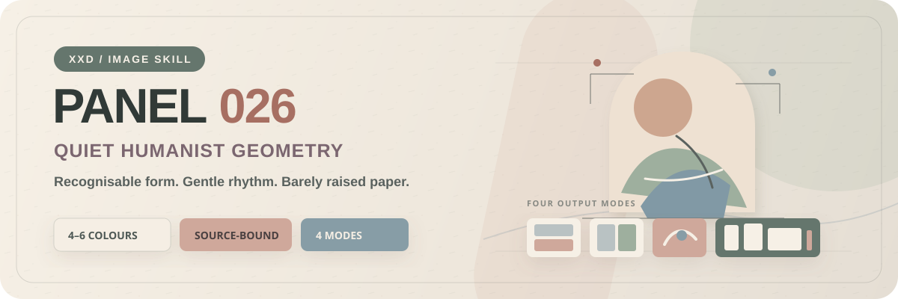

<p align="center">
  
</p>

<div align="center">

# 🦁 XXD Panel 026

### 写真に宿る事実を、静かでやわらかく、それでもひと目で分かる幾何学へ

[](./SKILL.md)
[](#4つの出力を支えるひとつのヒューマニスト幾何学)
[](#境界と信頼性)

<a href="README.md">简体中文</a> · <a href="README.en.md">English</a> · <strong>日本語</strong> · <a href="README.ko.md">한국어</a> · <a href="README.ar.md">العربية</a>

</div>

> RECOGNISE QUIETLY · REDUCE GENTLY · LET THE PAPER BREATHE

XXD Panel 026 は、Codex と互換 Agent のための画像生成 Skill です。写真の被写体、輪郭、姿勢、構造軸、距離、物語上の関係を読み取り、その根拠を、最小限の幾何形、細い線、やわらかな色群、紙からわずかに浮き上がるような浅いレリーフへ翻訳します。

写真に「くすみ色のフィルター」を重ねる仕組みではありません。その一枚を見る理由を、静かな造形として残すための Skill です。

## なぜ、この Skill が必要なのか

「写真をミニマルなポスターにする」と、同じ円、淡い色面、建築図面風の線だけが残りがちです。落ち着いて見えても、元の写真との結びつきは弱い。動きや関係はテンプレートへ置き換わり、別の写真でも同じ図形と見出しが使えてしまいます。

026 は、静けさを写真の根拠から組み立てます。

- 元写真に固有の識別要素を少なくとも三つ残す
- 被写体を消すのではなく、幾何形、輪郭線、構造線、余白で再編する
- 固定色票ではなく、元写真から低刺激の 4–6 色を導く
- 奥行きは紙の型押し程度に抑え、明確な 3D にしない
- 画面の意味と結びついたタイトルとマイクロコピーを標準で組み込む

## 写真の事実から、ヒューマニスト幾何学へ

内部では、次の順序で設計します。

**観察 → 識別 → 削減 → 人間味の付与 → 浅いレリーフ → 組版 → 検証**

視覚の中心は、あくまで被写体ひとつです。構図はおおむね中央へ寄せつつ、硬い左右対称にはしません。正負形、密度差、わずかなずれ、大きな余白でリズムをつくります。形は UI 上に浮くカードではなく、上質な紙からそっと押し出されたように見えるのが理想です。

色はアイボリー、暖白、淡いグレー、砂色、くすんだピンク、淡い黄土、霧がかった青、セージグリーンへ寄せることがあります。ただし、これは固定パレットではありません。主色、補助色、構造色は、必ずその写真の光、素材、空気から説明できる必要があります。

## 作例 · X より

> [Xiaoxiaodong（@xiaoxiaodong01）](https://x.com/xiaoxiaodong01/status/2090433161096581434) · 2026年8月20日<br>
> GPT2 × レリーフ × クロップ × 静けさ × 美学プロンプト × VOL.026<br>
> 写真を描き直すのではなく、面白さの核を拾い、数本の線と色面まで静かに削ぎ落としても、一目で元の場面だと分かる表現です。

<table>
  <tr>
    <td width="50%"><a href="https://x.com/xiaoxiaodong01/status/2090433161096581434"></a></td>
    <td width="50%"><a href="https://x.com/xiaoxiaodong01/status/2090433161096581434"></a></td>
  </tr>
</table>

<p align="center"><a href="https://x.com/xiaoxiaodong01/status/2090433161096581434">元の投稿と完全なプロンプトを見る →</a></p>

これらは 026 の美学的動機を示す作例です。投稿当時の画面比率を現在の既定値にはしません。4つのモードは、以下の元画像適応・カスタムサイズ方針に従います。

## 4つの出力を支えるひとつのヒューマニスト幾何学

4つのモードは単独でも複数でも選択できます。`1`、`1+3`、`1、2、4`、`全部` と返信すると、Skill が重複を除き 1→4 の順で実行します。各モードは別々のタスクフォルダに独立出力され、一覧画像にはまとめません。`全部` は元写真1枚につき7点（通常3モード各1点＋壁紙4点）です。サイズはモード名付きで同時指定でき、未指定の通常モードは元画像に適応します。文案は既定で選択モード間に共通し、モード別指定も可能です。

| モード | サイズ方針 | 成果物 |
| --- | --- | --- |
| 上下二分割 | 元画像に適応 | 上に元写真、下にヒューマニスト幾何学。各パネルは元画像全体のサイズを保ち、高さは厳密に半分ずつ |
| 左右二分割 | 元画像に適応 | 左に元写真、右にヒューマニスト幾何学。各パネルは元画像全体のサイズを保ち、幅は厳密に半分ずつ |
| デザインのみ | 元画像に適応 | 元写真は根拠として使い、完成画面には表示しない。元画像の比率とサイズを継承 |
| 壁紙セット | 端末別 | スマートフォン、iPad、PC、子ども向けスマートウォッチ用の独立 PNG 4点 |

ユーザー指定の正確なピクセル値を最優先し、未指定なら通常の3モードは固定比率を使わず元画像へ適応します。ユーザーが指定する上下二分割の全高、左右二分割の全幅は偶数である必要があります。指定寸法を黙って変更することはありません。

壁紙セットにも暗黙のサイズ既定値はありません。共通端末プリセット（スマートフォン `1440×3200`、iPad `2048×2732`、PC `3840×2160`、腕時計 `1024×1024`）を選ぶか、端末別の解像度を指定します。

壁紙セットでは、関係性を二つから選べます。

- **連続セット**：最初の一枚を基準作品として検証し、残り三枚は元写真と同じ基準作品を参照しながら、各端末向けに再構成します。
- **4枚を独立制作**：各端末が元写真だけを参照し、構図をより自由に展開します。

「連続」はトリミングを意味しません。4点すべてを別々に生成し、別々に構成し、別々に検証します。

## 言葉も、写真から設計する

自動コピーを選ぶと、ひとつの主タイトルと 2–4 組のマイクロコピーを組み込みます。見えている事実、関係の緊張、そこから無理なく読み取れる含意を言葉へ圧縮し、無関係な写真へ置き換えても成立しないかを確認します。別の写真でも使える文なら、書き直します。

生成前に、自動コピー、カスタムコピー、文字なしのいずれかを確認します。カスタムでは見出しと任意のマイクロコピーを直接入力でき、完成原稿は一字一句保持します。方向性や下書きの場合は、許可された範囲だけを整えます。

コピーの言語は、人物の外見ではなく、届け先で決まります。

**対象市場・地域 > 指定された出力言語 > 方向性に使われた言語；いずれも明示されていない場合は生成前に確認**

日本向けは自然な日本語、韓国向けは自然な韓国語、英国向けはイギリス英語、アラビア語版は自然な現代標準アラビア語と右から左の組版で表現します。逐語訳や外国語風のダミー文字ではなく、その地域で自然に響く言葉へトランスクリエーションします。

## はじめる

```bash
git clone https://github.com/nevertoday/xxd-panel-026.git
mkdir -p ~/.codex/skills
ln -s "$(pwd)/xxd-panel-026" ~/.codex/skills/xxd-panel-026
```

Claude Code では、同じフォルダーを `~/.claude/skills/xxd-panel-026` へリンクできます。インストール後は Agent セッションを再起動してください。

```text
$xxd-panel-026
この写真を上下二分割で制作してください。主タイトルは日本語で。
```

写真だけを添えて呼び出すこともできます。その場合は改行された番号付きメニューで一つまたは複数のモードを確認し、壁紙セットなら必要に応じて「連続セット」か「4枚を独立制作」かを続けて確認します。

完全な仕様：

- [Skill ワークフロー](SKILL.md)
- [中国語版フルプロンプト](references/xxd-panel-026-prompt.zh-CN.md)
- [英語版フルプロンプト](references/xxd-panel-026-prompt.en.md)
- [元のスタイル説明](references/026-source.md)

## 境界と信頼性

- 現在の写真だけが現在のタスクの内容ソースです。別入力、過去成果、作例の被写体を借りません。
- 同じ写真と同じパラメータでも、呼び出しごとに新しいタスクフォルダーを作ります。
- 二分割モードの写真領域は写真のまま保ち、抑制した調整と必要な背景拡張だけを行います。
- デザインのみと壁紙では元写真を表示せず、SVG、HTML、プログラム描画を画像生成の代用にしません。
- ビットマップ生成の可否は実際の能力で判断し、特定の環境変数がないという理由だけで不可能と断定しません。
- 安全なビットマップブリッジは匿名化された状態だけを返し、provider、endpoint、header、credential、Prompt、サーバー応答本文を表示しません。
- 選択した通常モードごとに1点を返し、`wallpaper-pack` を選ぶと独立壁紙4点を追加します。`全部` は元写真1枚につき7点を4つの同階層モードフォルダへ出力し、一覧コラージュにはまとめません。

ローカル合成には Python 3 と Pillow が必要です。安全なビットマップブリッジは Python 3.11+ の `tomllib` を使用します。実際の生成には、ホスト Agent の内蔵ビットマップ機能、または設定済みの互換ルートが必要です。

## リポジトリ構成

```text
xxd-panel-026/
├── SKILL.md
├── README.md / README.en.md / README.ja.md / README.ko.md / README.ar.md
├── agents/openai.yaml
├── assets/
│   ├── banner.svg
│   └── examples/
├── scripts/
│   ├── compose_panel.py
│   └── configured_imagegen.py
└── references/
    ├── xxd-panel-026-prompt.zh-CN.md
    ├── xxd-panel-026-prompt.en.md
    └── 026-source.md
```

## XXD について

XXD は Xiaoxiaodong のブランド名を略したものです。このプロジェクトは [@xiaoxiaodong01](https://x.com/xiaoxiaodong01) が制作・管理しています。

## サポートと会員特典

### 個別の深度相談｜CNY 299／時間

Skills の利用に関する 1 対 1 の深度相談は、1 時間あたり CNY 299 です。予約は、以下の WeChat QR コードから Xiaoxiaodong へご連絡ください。

### Xiaoxiaodong Skills ユーザー交流グループ｜参加費 CNY 99

一度の支払いで、使い方や制作事例の共有、メンバー同士の情報交換を行うユーザーグループに参加できます。時間制の 1 対 1 深度相談は含まれません。以下の WeChat QR コードから「Skills ユーザーグループ」と添えてご連絡ください。

### 知识星球＋会員向けプロンプトライブラリ｜年額 CNY 699

知识星球と [XXD 会員向けプロンプトライブラリ](https://vip.xiaoxiaodong.ai/)は、ひとつの会員特典です。**年額料金を一度支払えば両方を利用でき、二重に購入する必要はありません。**

登録方法は、次のどちらかを選べます。

1. [知识星球](https://wx.zsxq.com/group/15554814142882)で登録後、WeChat で Xiaoxiaodong に連絡し、会員向けプロンプトライブラリの引換コードを受け取る。
2. [会員向けプロンプトライブラリ](https://vip.xiaoxiaodong.ai/)で直接登録後、WeChat で Xiaoxiaodong に連絡し、知识星球への招待を受ける。

<p align="center">
  <a href="https://xiaoxiaodong.pages.dev/assets/wechat-qr.png"></a>
</p>

<div align="center">

**静けさはテンプレートではなく、写真から生まれる。**

</div>

---

<div align="center">
  <h2>☕ このオープンソースプロジェクトを応援する</h2>
  <p>このプロジェクトが役立ったら、Star、シェア、またはコーヒー一杯で応援していただけるとうれしいです。</p>
  <table>
    <tr>
      <td align="center" width="240">
        <a href="https://github.com/nevertoday/zhongguo-traditional-colors/blob/main/docs/images/buy-me-a-coffee-qr.png?raw=true"></a><br>
        <strong>Buy me a coffee</strong><br>
        <sub>QR コードを読み取るか開いて、Xiaoxiaodong を応援できます</sub>
      </td>
    </tr>
  </table>
  <p><sub>支援は任意であり、このオープンソースプロジェクトの利用条件には影響しません。</sub></p>
</div>
